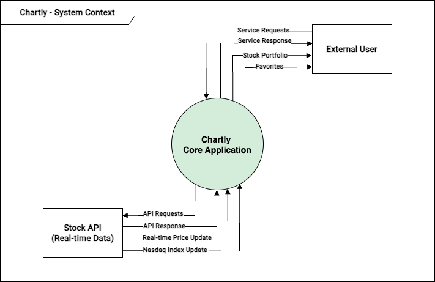

# Requirement Analysis

> **This document outlines the requirements for the Chartly stock portfolio website, including functional, non-functional, and technical specifications.**

## Table of Contents

1. [Functional Requirements](#functional-requirements)
2. [Non-functional Requirements](#non-functional-requirements)
3. [System Requirements](#system-requirements)
4. [Technical Constraints](#technical-constraints)

## Project Background and Goals

Chartly is a stock portfolio platform that allows users to monitor, analyze, and visualize stocks.

### Goals

- Delivers real-time stock insights through intuitive and interactive user interfaces
- Offers portfolio management tools to monitor and track investment returns
- Enhances user experience by visualizing trends of favorite stocks

## Functional Requirements

### Main Features

- **Stock Returns Visualization**
    - Users can input stock names, datews, and percent returns to generate visual charts.
    - Offers real-time updates and dynamic chart adjustments based on user inputs.
    - Display today's returns on the dashboard as a chart.
    - The chart will be displayed as both a pie chart and a line chart
- **Favorite Stocks & Trend Analysis**
    - Users can click "Favorite" button to save selected stocks.
    - Display weekly, monthly, or yearly trends of favorite stocks.
    - Display the daily return and price change of favorite stocks compared to the previous day on the dashboard.
    - Filter and visualize stock trends with customizable date ranges.
    - Maximum of 4 favorite stocks.
- **Stock Portfolio Management**
    - Interactive visualizations, including pie charts for portfolio distribution and line charts for total returns over time.
    - Support for adding, editing, or removing portfolio holdings.

### User Input and Output

**User Input**

- **Input Fields**
    - Stock name: Text input
    - Returns (%): Numeric Input
    - Date: Date picker
- **Validation Rules**
    - Stock name: non-emnpty and alphanumeric
    - Returns(%): Accepts numeric values greater than or equal to -100 and no upper limit
    - Date: Follow `YYYY-MM-DD` format

**User Output**

- **Visualization**
    - Interactive charts generated based on user input
    - Real-time portfolio summary displayed in both numeric and graphical formats
- **Feedback** 
    - Success messages for valid input
    - Error messages for invalid data


### Error Handling

- **Input Validation Errors**
    - If the stock name field is empty
        - Message: "Stock name cannot be empty.
    - If the return percentage is out of range
        - MESSAGE: "Return percentage must be more than -100 
- **Data Processing Errors**
    - If duplicate stock names are entered in the portfolio
        - Message: "This stock is already in your portfolio."
- **System Errors**
    - If the API for fetching real-time prices fails
        - Message: "Unable to fetch real-time data. Please check your internet connection."
    - Logs: Record errors with timestamps for debugging

### Data Management 
 
**Data Storage**
- All data is stored in a PostgreSQL database for reliable and scalable management
- The database includes structured tables to manage different types of data
    - Users: Stores user information
    - Favorites: Stores users' favorite stocks with timestamps
    - Stock Data: 

**Data Processing**

- Calculate individual stock returns
    ```
    calculateReturn = ((currentPrice - buyPrice) / buyPrice) * 100
    ```

- Aggregate portfolio data:
    - Total investment, total current value, and overall returns.


## Non-Functional Requirements

### Performance
- Response Time: After a button click, the screen must update within 1 second.
- Throughput: The system must handle up to 50 concurrent users seamlessly.
- Latency: Search results should be returned within an average of 2 seconds.

### Security
- Authentication: Users must log in via email and password.
- Data Encryption: Password must be encrypted using Bcrypt.

### Maintainability
 - Documentation: Main features and API usage must be documented in the MarkDown file.

### Platform/Compatibility

## System Requirements


### Software Environment

- Server: Ubuntu 22.04.5 LTS
- Database: PostgreSQL 13.5
- Web Server: Nginx 1.27


## Technical Constraints

### Technology Stack Constraints

- Backend can only be developed using PHP.
- Frontend can only be developed using HTML, CSS, and JavaScript.
- Database must exclusively use PostgreSQL.
- Real-time data processing must be implemented using RabbitMQ.
